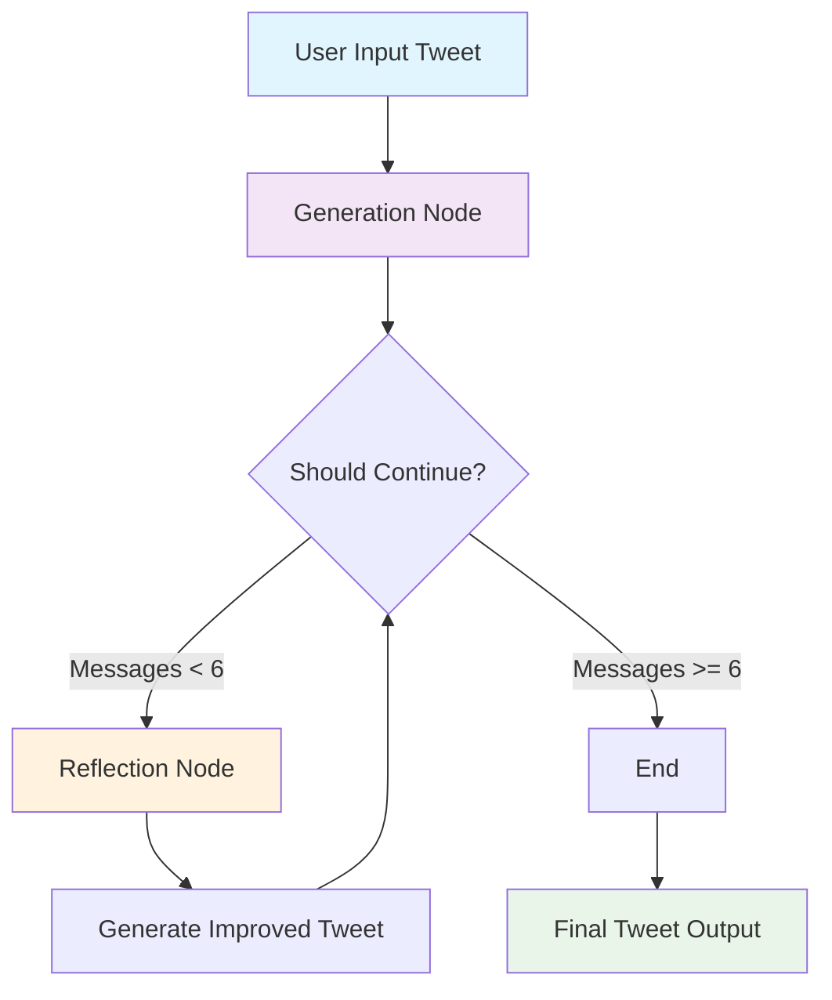
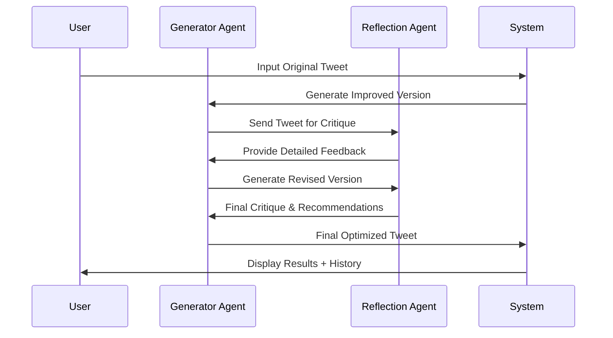
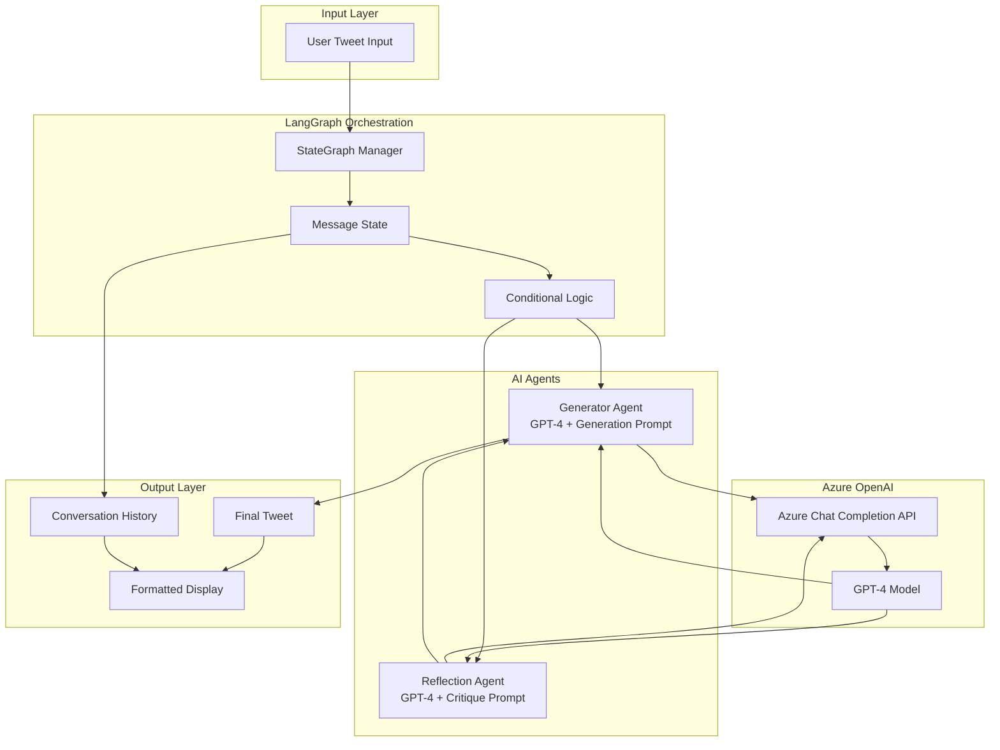

# Tweet Reflection & Critique Agent 🐦✨

A multi-agent AI system built with LangGraph that automatically improves tweets through iterative reflection and critique. This project demonstrates the power of agentic AI workflows using the generate-critique-reflect pattern.

## 🎯 Overview

This agent takes your initial tweet and runs it through multiple rounds of AI-powered critique and improvement, producing viral-ready Twitter content. The system uses a reflection pattern where two specialized AI agents collaborate:

- **Generator Agent**: Creates and refines tweet content
- **Reflection Agent**: Provides detailed critique and recommendations

## 🏗️ Architecture

### System Overview
```
┌─────────────────────────────────────────────────────────────────┐
│                    Tweet Reflection Agent System                │
└─────────────────────────────────────────────────────────────────┘

    User Input Tweet
           │
           ▼
    ┌─────────────────┐
    │ Generation Node │ ◄─────────────────────┐
    │ (Generator AI)  │                       │
    └─────────────────┘                       │
           │                                  │
           ▼                                  │
    ┌─────────────────┐                       │
    │ Should Continue?│                       │
    │ (< 6 messages)  │                       │
    └─────────────────┘                       │
           │                                  │
       ┌───┴───┐                             │
       │       │                             │
      Yes      No                            │
       │       │                             │
       ▼       ▼                             │
┌─────────────────┐  ┌─────────────────┐     │
│ Reflection Node │  │      END        │     │
│ (Critique AI)   │  │ Final Output    │     │
└─────────────────┘  └─────────────────┘     │
       │                                    │
       ▼                                    │
┌─────────────────┐                         │
│ Generate        │                         │
│ Improved Tweet  │ ────────────────────────┘
└─────────────────┘
```

### Agent Interaction Flow
```
┌─────────────┐    ┌──────────────────┐    ┌─────────────────┐
│    User     │───▶│     System       │───▶│   Generator     │
│   Input     │    │   Orchestrator   │    │     Agent       │
└─────────────┘    └──────────────────┘    └─────────────────┘
                            │                        │
                            │                        ▼
                            │               ┌─────────────────┐
                            │               │  Tweet v1.0     │
                            │               │   Generated     │
                            │               └─────────────────┘
                            │                        │
                            │                        ▼
                            │               ┌─────────────────┐
                            │               │   Reflection    │
                            │◄──────────────│     Agent       │
                            │               │   (Critique)    │
                            │               └─────────────────┘
                            │                        │
                            ▼                        ▼
                   ┌─────────────────┐      ┌─────────────────┐
                   │  Improvement    │      │   Detailed      │
                   │     Loop        │      │   Feedback      │
                   │  (2-3 cycles)   │      │ & Suggestions   │
                   └─────────────────┘      └─────────────────┘
                            │
                            ▼
                   ┌─────────────────┐
                   │ Final Optimized │
                   │     Tweet       │
                   │  + Full History │
                   └─────────────────┘
```

### LangGraph State Machine
```
States: [GENERATE] ──► [REFLECT] ──► [GENERATE] ──► [END]
           │              │              │
           ▼              ▼              ▼
    ┌─────────────┐ ┌─────────────┐ ┌─────────────┐
    │ Create/     │ │ Analyze &   │ │ Refine &    │
    │ Improve     │ │ Critique    │ │ Optimize    │
    │ Tweet       │ │ Content     │ │ Final Ver   │
    └─────────────┘ └─────────────┘ └─────────────┘
```

> **💡 Interactive Diagrams**: For interactive Mermaid diagrams, view this README in:
> - [GitHub's web interface](https://github.com) (native Mermaid support)
> - [Mermaid Live Editor](https://mermaid.live) - Copy the raw Mermaid code below
> - VS Code with Mermaid extension

<details>
<summary>📊 Click to view Mermaid source code for interactive diagrams</summary>

**State Flow Diagram:**


**Sequence Diagram:**


**Detailed Architecture:**

</details>

## ⚡ Key Features

- **Iterative Improvement**: Multiple rounds of generation and critique
- **Viral Optimization**: Focuses on engagement, brevity, and Twitter best practices
- **Azure OpenAI Integration**: Powered by GPT-4 for high-quality responses
- **Conversation History**: Full transparency of the improvement process
- **Clean Output**: Readable final tweet separated from technical details

## 🚀 Quick Start

### Prerequisites

- Python 3.8+
- Azure OpenAI API access
- Required environment variables

### Installation

1. Clone the repository:
```bash
git clone <repository-url>
cd reflection-tweet-critique-agent
```

2. Install dependencies:
```bash
uv sync
# or pip install -r requirements.txt
```

3. Set up environment variables in `.env`:
```env
AZURE_OPENAI_CHAT_DEPLOYMENT_NAME=your-deployment-name
AZURE_OPENAI_API_VERSION=2024-02-15-preview
AZURE_OPENAI_ENDPOINT=https://your-resource.openai.azure.com/
AZURE_OPENAI_API_KEY=your-api-key
```

### Usage

Run the agent:
```bash
uv run python main.py
```

Enter your tweet when prompted, and watch the AI agents collaborate to improve it!

## 📋 Example Output

**Input Tweet:**
```
Agentic AI frameworks are assumed to be hard to understand, and its underrated. 
I just developed the multi-agentic flow using the reflection pattern which actually 
revies the tweets with generate-critique-reflect pattern and easy to chains.
```

**Final Improved Tweet:**
```
⚡️ Hot take: Agentic AI isn't as complex as people think—just built a multi-agent 
system using reflection patterns that auto-improves tweets through 
generate→critique→reflect cycles. 

The results? 🔥 Better engagement, cleaner copy.

Who's building with agentic workflows?
```

## 🛠️ Technical Stack

- **LangGraph**: State management and workflow orchestration
- **LangChain**: LLM integration and prompt management
- **Azure OpenAI**: GPT-4 for generation and critique
- **Python**: Core implementation
- **dotenv**: Environment variable management

## 📊 Agent Specialization

### Generator Agent
- Focuses on creating engaging, viral-ready content
- Incorporates feedback from reflection agent
- Optimizes for Twitter's character limits and format
- Emphasizes action-oriented language and hooks

### Reflection Agent
- Provides detailed critique on virality potential
- Analyzes structure, length, and engagement factors
- Recommends specific improvements
- Grades tweets and suggests formatting changes

## 🔧 Configuration

The system uses conditional logic to determine when to stop the reflection loop:
- Maximum of 6 messages in the conversation
- Ensures quality improvement without infinite loops
- Balances thoroughness with efficiency

## 🎨 Customization

You can modify the agent behavior by updating the prompt templates in `main.py`:

- `reflection_prompt`: Adjust critique criteria and grading style
- `generation_prompt`: Modify the tweet generation approach
- `should_continue`: Change the stopping conditions

## 📈 Future Enhancements

- [ ] Add support for tweet threads
- [ ] Include image/media suggestions
- [ ] A/B testing capabilities
- [ ] Analytics integration
- [ ] Custom style preferences
- [ ] Batch processing mode

## 🤝 Contributing

Contributions are welcome! Please feel free to submit a Pull Request.

## 📄 License

This project is licensed under the MIT License - see the LICENSE file for details.

## 🙋‍♂️ Author

Built with ❤️ using LangGraph and Azure OpenAI to demonstrate practical agentic AI workflows.

---

*Ready to make your tweets go viral? Give it a try!* 🚀 